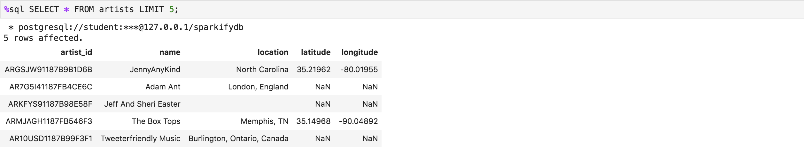
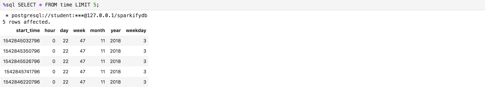

# PURPOSE

This database enables Sparkify to query what songs users are listening to.
Sparkify collects data as song_data and log_data which comprise the data foundation fo its analytics endeavor.
The song data consists of songs and artists data. song_data organized by the first three letters of the Track IDs. The log data contains information about users, and the time a users listens to particular songs of particular artists. log_data is organised by year, month and day.

# SCHEMA DESIGN

To enable Sparkify to search songs users listen to a star database schema was used.
songplays functions as the facts table. 

Songlays table
 

songs, artists, users and time are separate dimension tables whose data is connected to the facts data by means of foreign key relations using song_id, artist_id, users_id and start_time.

Songs table
 

Artists table
 

Users table
 

Time table
 

# ETL PIPELINE

The data to fill the outline schema comes from two input file types:
* song_data
* log_data

From song_data files that are ordered in folders named after the first three track letters, contain the data to fill the songs and artists table.
Each file contains data about one song and its artist in JSON format.

Song_data file - example.
 

From log_data files that are ordered in folders by year and month contain the data to fill the users, time and songplays table.
Each files contains all songplay logs having been logged on one day. So each contains enties for each songplay in JSON.
Each file contains data for the songplays, users and time table.

Log_data file - An example log in one of the files in JSON.
 

## ETL Process:

### Overview and files.
The database as well as ETL process belonging to is implemented using PostgreSQL und Pythons (psycopg2).
The ETL process consists of:
* database and table creation ( create_tables.py ) 
* data ingestion using etl.py

Both parts use PostgreSQL queries that are pre-defined in sql-queries.py.

### ETL Description

creates_table.py.

Executing creates_table.py drops tables if they exists and (re-)creates the tables specified in [Schema](#schema)

# EXAMPLE QUERIES

Returns songs and how often they where played 

%%sql SELECT songs.title, artists.name, count(*)
FROM songplays, songs, artists
WHERE 
songplays.song_id = songs.song_id AND 
songplays.artist_id = artists.artist_id
GROUP BY(songs.song_id, artists.artist_id)

The readme looks fine.. I would encourage you to use images, like screenshots of your final tables, and adding more details about your project, such as the dataset and how you cleaned the data. I’d also encourage you to remove any comments that are part of the Instructions. Your readme file should reflect atleast the following specifications:

Purpose of this database in the context of the startup, Sparkify, and their analytical goals.
State and justify your database schema design and ETL pipeline.