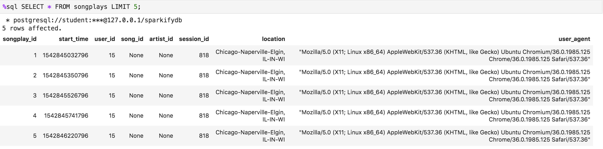
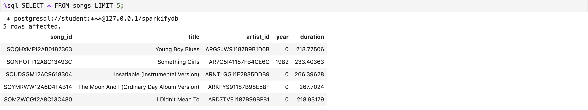

## PURPOSE

This database enables Sparkify to query what songs users are listening to.
Sparkify collects data as song_data and log_data which comprise the data foundation for its analytics endeavor.

## <a name="schema"></a>SCHEMA DESIGN

To enable Sparkify to search songs users listen to a star database schema was used.
songplays functions as the facts table. songs, artists, users and time are its dimension tables.
The idea behind this is that data about the dimension (except time) tables will not change so much and will not grow as large as the songplays data will.
Hence JOINS between songplays and its dimension tables (except time) can be executed with relatively low resource consumption.

### Table layouts

**Songlays table**



songs, artists, users and time are separate dimension tables whose data is connected to the facts data by means of foreign key relations using song_id, artist_id, users_id and start_time.

**Songs table**



**Artists table**


**Users table**


**Time table**


## ETL PIPELINE

### Sources

The data to fill the [schema](#schema) originates from the file types:
* song_data (=> songs, artists)
* log_data (=> users, time, songplays)

*song_data* files (ordered in folders by the 1st three track letters) contain **songs** and **artists** data.
Each file contains one song and its artist in JSON format.

**Song_data file - example.**


*log_data* files (ordered in folders by year/month) contain **users**, **time** and **songplays** data.
Each file contains all songplays per day in a JSON format each. Each JSON string contains data for a user, time and songplay.

**Log_data file - An example log in one of the files in JSON.**


### ETL Process

#### Overview and usage of files

The database and its ETL process is implemented using PostgreSQL und Python (psycopg2).

The ETL process consists of:
1) database and table creation (*create_tables.py*)
2) data ingestion using (*etl.py*)
3) both files use pre-defined queries (*sql-queries.py*).
4) finished etl jobs can be inspected using *test.ipynb*

#### Usage

To run the ETL process the following commands have to executed in this order:

```shell
python create_tables.py
python etl.py
```

To inspect the imported data test.ipynb can be used:

```shell
jupyter notebook test.ipynb
```

#### ETL Description

**creates_table.py**

Executing creates_table.py drops tables if they exists and (re-)creates the tables specified in [Schema Design](#schema)

**Function:**
* create_database
* drop_tables
* create_tables
* main: executes aformentioned functions in given order.

Uses queries defined in *sql_queries.py*

**etl.py**

**Function:**
* process_song_file: reads from a given song_data file data into a dataframe, selects columns for songs and artists separately and inserts the data into db tables with same names. 
* process_log_file: reads from a given log_data file data into a dataframe. For each each row it selects columns for users, time and songplays separately and inserts the data into db tables with same names. 
* process_data: a function iterating over files found in a directory and all subdirectories of a given path and execute a function for each filepath
* main: calls process_data with process_song_file and process_log_file as function and hence launches the etl process.

**sql_queries**

Contains drop, create, insert and select SQL Queries as python strings with %s placeholders for customization of the queries with field names etc.

**test.ipynb** 

Runs *create_tables.py* and *etl.py* as well as multiple queries to inspect table contents as well as some test queries.


## EXAMPLE QUERIES

Returns songs and how often they where played 

```
SELECT songs.title, artists.name, count(*)
FROM songplays, songs, artists
WHERE 
songplays.song_id = songs.song_id AND 
songplays.artist_id = artists.artist_id
GROUP BY(songs.song_id, artists.artist_id)
```

The readme looks fine.. I would encourage you to use images, like screenshots of your final tables, and adding more details about your project, such as the dataset and how you cleaned the data. I’d also encourage you to remove any comments that are part of the Instructions. Your readme file should reflect atleast the following specifications:

Purpose of this database in the context of the startup, Sparkify, and their analytical goals.
State and justify your database schema design and ETL pipeline.